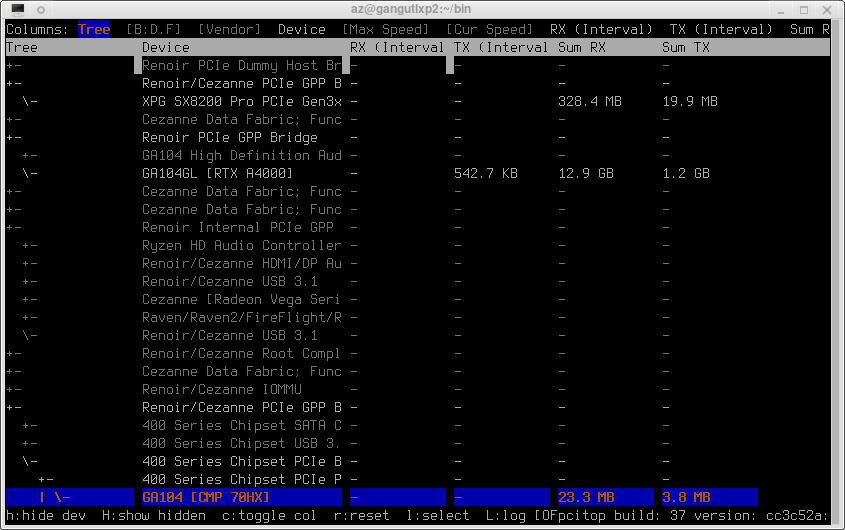
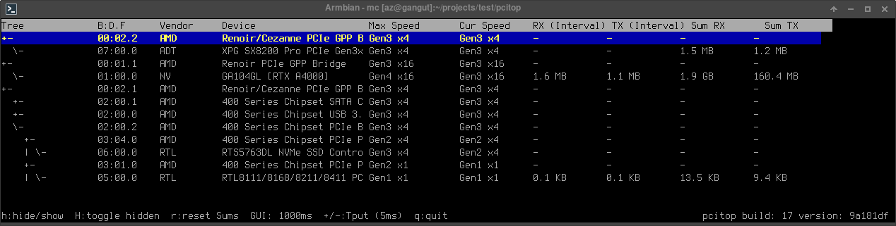

# pcitop

**pcitop** is a relatively low-precision, real-time diagnostic utility for Linux that visualizes the PCIe device topology and monitors data throughput across the bus.



## Features

- **Topology Visualization**: Displays a hierarchical tree of PCIe bridges and devices, similar to `lspci -t`.
- **Real-time Throughput**: Monitors active transfer rates (MB/s) for:
    - **NVIDIA GPUs** (integrated via `nvidia-smi`).
    - **Network Interfaces** (via sysfs counters).
    - **NVMe Storage** (via block device statistics).
- **Interval Summation**: Displays the total amount of data moved during each GUI refresh interval for accurate burst tracking.
- **Cumulative Totals**: Tracks total RX/TX data since start or last reset.
- **Persistence**: Save visibility settings (hide/show devices) to `pcitop.ini`.
- **Non-Root Support**: Automatically falls back to sysfs to display link speeds and widths when run without `sudo`.
- **Decoupled Architecture**: High-frequency background sampling (up to 1ms) with a stable, throttled GUI (1s) to eliminate flickering.

## It's NOT a

- Not a full logging tool. Some logging info can be added later - but it's not a goal of this tool
- Not working with different internal buses which just looks like PCI for OS - like AMD Infinity Fabric inside of APU

## Screenshots

- Show only interesting devices


## Keybindings

| Key | Action |
|-----|--------|
| `Up` / `Down` | Navigate device list |
| `PgUp` / `PgDn` | Scroll page |
| `h` / `Space` | Toggle device visibility (hidden/visible) |
| `H` | Toggle "Show All" vs "Hide Hidden" mode |
| `r` | Reset throughput counters |
| `+` / `-` | Increase/Decrease throughput sampling interval (1ms steps) |
| `c` and cursor Left/Right | to select and hide/show columns |
| `q` | Quit |

## Installation

### Dependencies
- `libpci-dev`
- `libncurses5-dev`
- `cmake`
- `git`

### Build Instructions

```bash
mkdir build
cd build
cmake ..
make
```

## Running

```bash
./pcitop
```
*Note: Run with `sudo` for full access to hardware registers and more detailed link capability information.*

## License
MIT License

## Implementation

- This version mostly implemented with Google Antigravity using Gemini 3 Flash and Gemini 3 Pro models with some manual coding/fixing.
- While I implement a few more version of pcitop - by hands and with local models like qwen 3.6 and gemma4 - this version looks more promising and suitable for third-party use.
